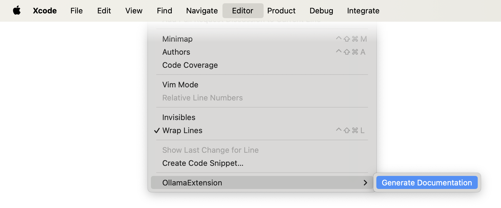

Llama is open language model developed by Meta AI. While there are many GPT and language model products available now, what makes Llama interesting is that it can run locally on your computer. This means no API quotas, no service downtime and no concerns about sharing your private data with third parties.

The latest* available Llama version is 3.1 and it has three models:

* `8B` 4.7 GB
* `70B` 40 GB
* `405B` 229 GB

The easiest way to install and run Llama is through Ollama app. Simply [download Ollama](https://ollama.com/download), then type `ollama run llama3.1` in your terminal. By default, it installs the `8B` model. I also tried the `70B`, but it took a long time to generate responses and consumed 30GB of RAM, so I wouldn’t recommend running it on a personal device.

After entering the above command, you'll see the Llama prompt, a familiar AI interface where you can ask questions. The conversation context will be retained until you quit and used to to generate more detailed responses.

I've used it for quite a while, and I'm pretty happy with the quality of 
responses, considering the size of the model.

In addition to the fact that it works very fast, does not require an internet connection, has no limit on the number of requests, and generates good enough quality responses, it has another great feature – an API. Technically, this is not a feature of Llama itself, but a feature of the Ollama app.

The API allows you to create any workflow you want, and I'd like to show you an example of how to use it to extend Xcode's functionality.

## Creating an Xcode extension

First, you need to create a new __macOS app project__. This is important 
because other types of projects like command line tools cannot provide 
extensions.

After that, add a new target - `Xcode Source Editor Extension`. 
By default it contains a template to write extension logic

```swift
class SourceEditorCommand: NSObject, XCSourceEditorCommand {
    func perform(with invocation: XCSourceEditorCommandInvocation, completionHandler: @escaping (Error?) -> Void ) -> Void {
        completionHandler(nil)
    }
}
```

Lets write an extension for generating code documentaion using Llama. Rename the command `SourceEditorCommand` to `GenerateDocumentationCommand` inside `.swift` file and inside extension `info.plist`

```xml
<key>XCSourceEditorCommandDefinitions</key>
<array>
	<dict>
		<key>XCSourceEditorCommandClassName</key>
		<string>$(PRODUCT_MODULE_NAME).GenerateDocumentationCommand</string>
		<key>XCSourceEditorCommandIdentifier</key>
		<string>$(PRODUCT_BUNDLE_IDENTIFIER).GenerateDocumentationCommand</string>
		<key>XCSourceEditorCommandName</key>
		<string>Generate Documentation</string>
	</dict>
</array>
```

Select your extension as a target and press run. The other instance of Xcode should be launched with a new extension available:



Now lets write the extension logic. The way I would like to use it inside Xcode is by selecting code block and pressing key to execute this custom extension.

```swift
func perform(with invocation: XCSourceEditorCommandInvocation, completionHandler: @escaping (Error?) -> Void ) -> Void {
    
    guard let selection = invocation.buffer.selections.firstObject as? XCSourceTextRange else {
        completionHandler(nil)
        return
    }
    
    let selectedText = (selection.start.line...selection.end.line)
        .reduce(into: String()) { $0 += invocation.buffer.lines[$1] as? String ?? "" }
    
    Task {
        do {
            let promt = "You are given a code in Swift, you need to write a documentation for it. Dont add any additional replies, do only what you have been asked. Here is the code:" + "\n```\n" + selectedText + "\n```"
            let response = try await askLlama(promt)
            
            response
                .split(whereSeparator: \.isNewline)
                .reversed()
                .forEach { invocation.buffer.lines.insert($0, at: selection.start.line) }
            
            completionHandler(nil)
        } catch {
            completionHandler(error)
        }
    }
}
    
func askLlama(_ input: String) async throws -> String {

}
    
```

The logic of command is simple - get selected text, create a promt asking to generate documentation for this code and replace the selection with response from Llama.

Asking Llama can be done by sending `POST` request to Ollama server which runs on port `11434` by default.

Request format:

```json
{
  "messages": [
    {
      "role": "user",
      "content": ""
    }
  ],
  "stream": false,
  "model": "llama3.1"
}
```

Expected response format:

```json
{
  "model": "llama3.1",
  "created_at": "2024-07-20T12:00:00.000000Z",
  "message": {
    "role": "assistant",
    "content": ""
  },
  "done_reason": "stop",
  "done": true,
  "total_duration": 1234567890,
  "load_duration": 1234567890,
  "prompt_eval_count": 123,
  "prompt_eval_duration": 1234567890,
  "eval_count": 123,
  "eval_duration": 1234567890
}
```

Implementation of `askLlama(:)` function:

```swift
func askLlama(_ input: String) async throws -> String {
    guard let url = URL(string: "http://localhost:11434/api/chat") else { throw URLError.init(.badURL) }
    let body = try JSONEncoder().encode(LlamaRequest(userMessage: input))
    
    var request = URLRequest(url: url)
    request.httpMethod = "POST"
    request.httpBody = body
    
    let (data, _) = try await URLSession.shared.data(for: request)
    let response = try JSONDecoder().decode(LlamaResponse.self, from: data)
    
    return response.message.content
}

struct Message: Codable {
    var role: String
    var content: String
}

struct LlamaRequest: Codable {
    var model: String
    var messages: [Message]
    var stream: Bool
}

struct LlamaResponse: Codable {
    let model: String
    let createdAt: String
    let message: Message
    let doneReason: String
    let done: Bool
    let totalDuration: Int
    let loadDuration: Int
    let promptEvalCount: Int
    let promptEvalDuration: Int
    let evalCount: Int
    let evalDuration: Int

    enum CodingKeys: String, CodingKey {
        case model = "model"
        case createdAt = "created_at"
        case message = "message"
        case doneReason = "done_reason"
        case done = "done"
        case totalDuration = "total_duration"
        case loadDuration = "load_duration"
        case promptEvalCount = "prompt_eval_count"
        case promptEvalDuration = "prompt_eval_duration"
        case evalCount = "eval_count"
        case evalDuration = "eval_duration"
    }
}

extension LlamaRequest {
    
    init(model: String = "llama3.1", userMessage: String) {
        self.model = model
        self.messages = [.init(role: "user", content: userMessage)]
        self.stream = false
    }
}
```

And that is it.



As you can see the core logic is just a promt to AI. So you can create any command just by modifing it, for example write unit tests, generate mock data for previews, localization strings, database models, convert layout code from snapkit to pure autolayout, split huge view controllers to extensions and more.

So if you find yourself making the same thing over and over and you are lazy to do copy/paste with ChatGPT you can automate your workflow this way.